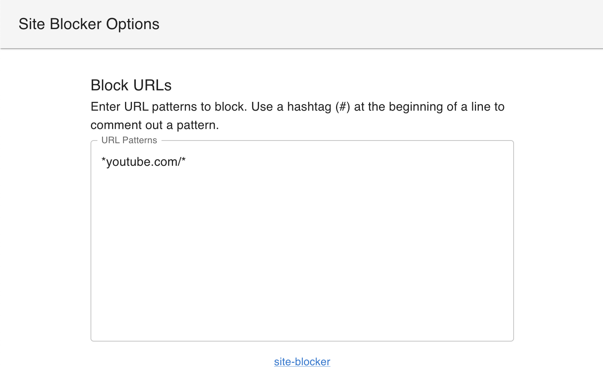

# 🚫 site-blocker

A simple browser extension that blocks access to a list of websites.

## How it works

A list of urls can be configured in the extension's options. Any tab that matches a url in the list will be closed automatically and a notification will be shown.

## Building & Installation

1. Clone the repository
2. Run `npm install`
3. Run `npm run build`
4. Load the extension from the `dist` directory
